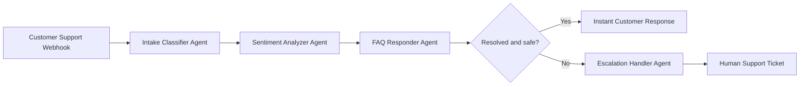

# Agentic Customer Support System - Milestone 2

## Scope Completed

- Intake classifier agent categorizes incoming queries by topic and urgency.
- FAQ responder agent performs knowledge base lookup and generates a response for common cases.
- Webhook endpoint receives customer support queries at `POST /webhook/support`.
- Basic orchestration connects webhook intake to classifier, sentiment analyzer, FAQ responder, and escalation handler.
- Escalation handler creates a human handoff ticket for high urgency, highly negative, or unresolved cases.
- Submission scope is complete up to Milestone 2.

## Architecture



## Agent Responsibilities

| Agent | Responsibility |
| --- | --- |
| Intake Classifier | Detects topic such as billing, technical, or general and assigns urgency. |
| FAQ Responder | Looks up matching FAQ entries and prepares an instant answer. |
| Sentiment Analyzer | Flags negative customer mood so sensitive cases can be escalated. |
| Escalation Handler | Creates a human support ticket for unresolved or urgent messages. |
| Orchestrator | Coordinates the agent sequence and returns a single workflow result. |

## Webhook Contract

Endpoint:

```http
POST /webhook/support
Content-Type: application/json
```

Example request:

```json
{
  "customer": {
    "name": "Asha",
    "email": "asha@example.com"
  },
  "message": "How do I request a refund for a charged invoice?"
}
```

Example response:

```json
{
  "status": "answered",
  "routingPath": ["webhook", "intake-classifier", "sentiment-analyzer", "faq-responder"],
  "classification": {
    "topic": "billing",
    "urgency": "low"
  },
  "finalResponse": "I can help with billing..."
}
```

## Local Demo Commands

Install is not required because this milestone uses only built-in Node.js modules.

```bash
npm test
npm start
```

In another terminal:

```bash
curl -X POST http://localhost:3000/webhook/support \
  -H "Content-Type: application/json" \
  -d '{"customer":{"name":"Asha","email":"asha@example.com"},"message":"How do I request a refund for a charged invoice?"}'
```

## n8n or Flowise Mapping

This implementation mirrors the planned n8n/Flowise workflow:

1. Webhook trigger receives the customer query.
2. Classifier node categorizes topic and urgency.
3. Sentiment node flags negative interactions.
4. FAQ lookup node searches the knowledge base.
5. Conditional router decides whether to respond immediately or escalate.
6. Escalation node creates a human support ticket.

The code can be connected to n8n or Flowise by calling the same `POST /webhook/support` endpoint from a webhook trigger or HTTP request node.

An importable n8n-style workflow template is included at `docs/n8n-workflow-template.json`.
